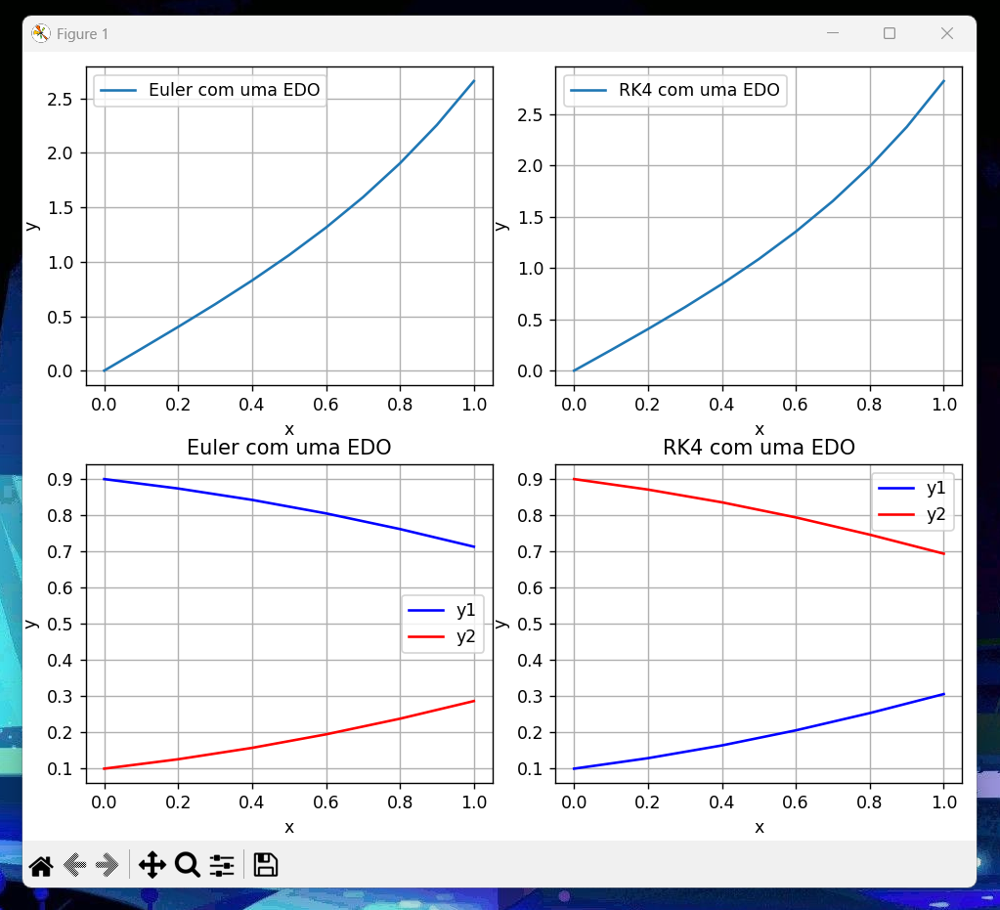
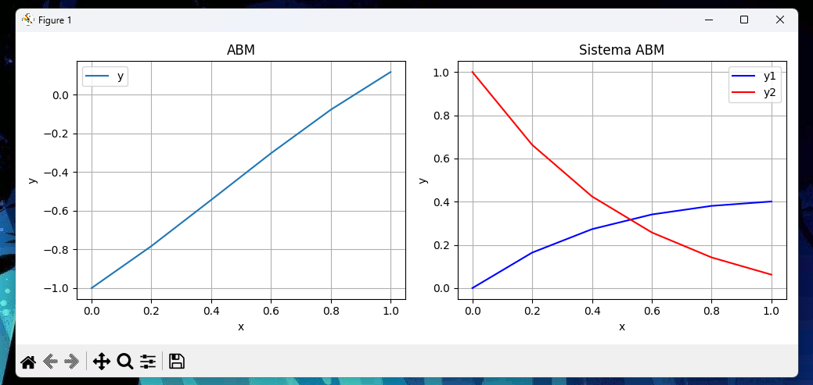

[Português]

## Métodos para Equações Diferenciais Ordinárias

Este é um repositório com implementações em Python de métodos que possibilitam o cálculo de EDOs.

---

### Descrição

Este repositório contém implementações dos seguintes métodos:

== Euler ==
- Simples
- Melhorado [em implementação]
- Modificado [em implementação]

== Runge Kutta ==
- 2º Ordem [em implementação]
- 4º Ordem

== Adams-Bashforth-Moulton ==
- Uma EDO
- Duas EDOs (sistema)

---

### Resultado Esperado para Euler simples + RK4


### Resultado Esperado para ABM simples + sistema


---

### Desenvolvedora

- [@kamilyassis](https://www.github.com/kamilyassis)

---

### Profª Orientadora da Disciplina

- Profª Drª Ana Paula Wyse

---

### Instalação

Para clonar o repositório pelo git:

```bash
git clone https://github.com/kamilyassis/edo_codes
````


